# Homage to Long Walk

Installation info Danielle Giudici Wallis

## Parts:

-   Foot pedal
-   Cardboard box tower
-   Bluetooth speaker, cord and power adaptor/charging brick
-   Arduino
-   Raspberry pi with monitor power cord
-   Keyboard and usb cord
-   Screen
-   Mouse
-   Power cables
-   Breadboard
-   Jumper wires
-   mat

Pedal: Top and bottom of wooden foot pedal are pressure fit only. To assemble, align cover and cord (there is a small hole at the top for the cord); press firmly. To disassemble, lift wooden foot pedal and press firmly on wooden bottom.

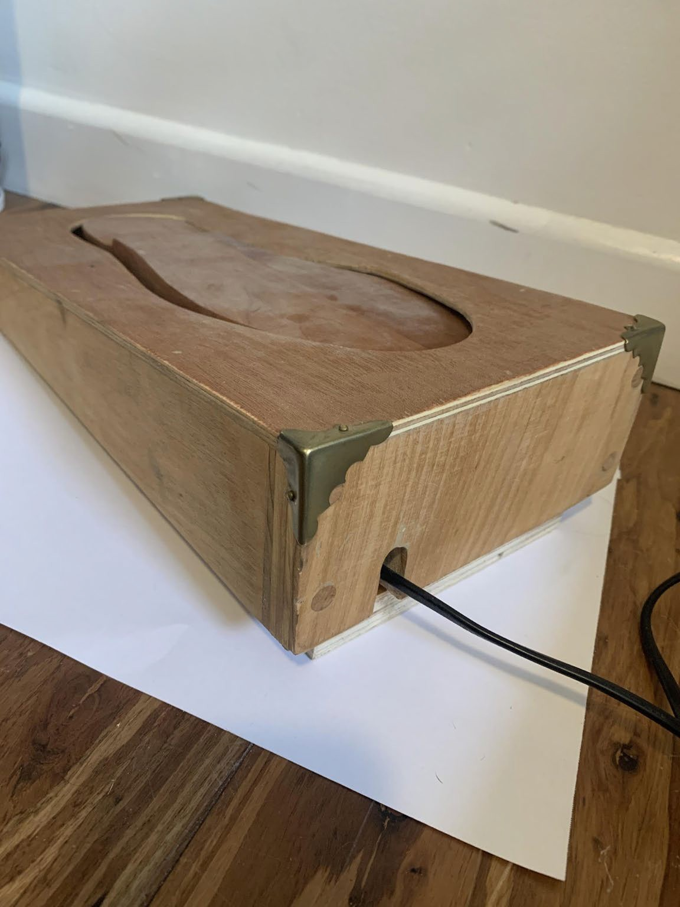

## Arduino and bread board connections

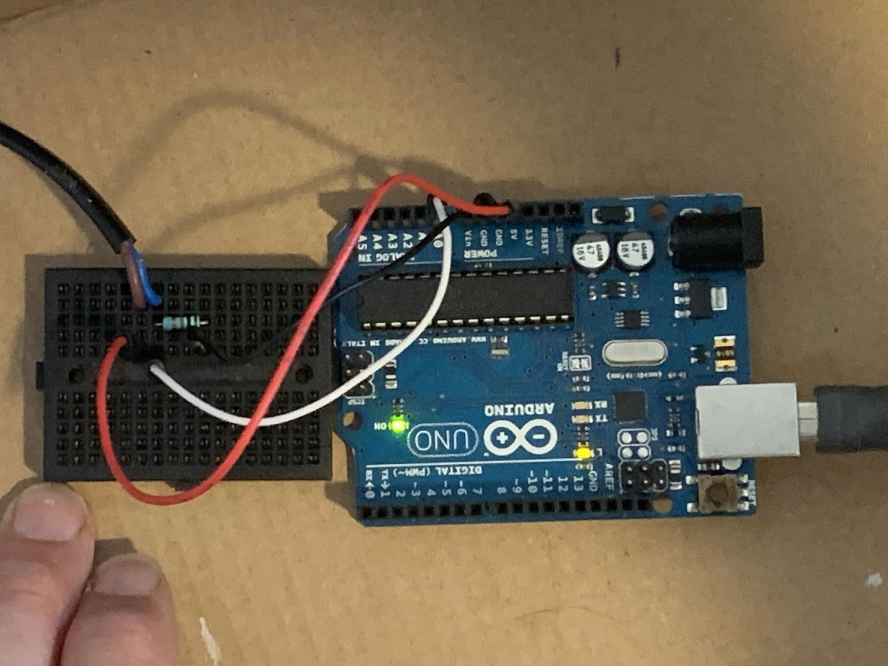

## Bread Board diagram
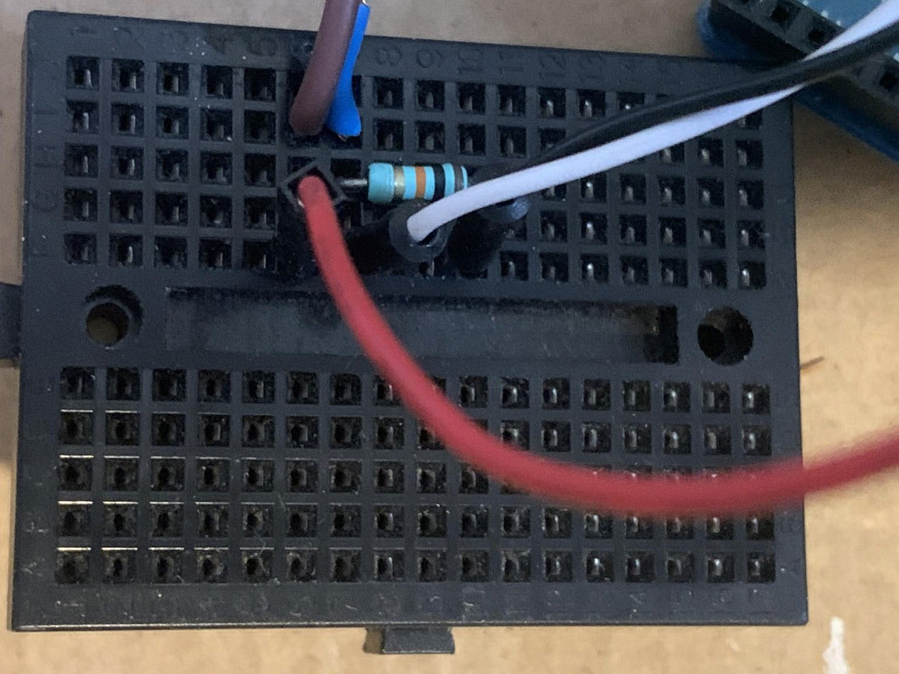

-   Wires from Pedal to Bread Board
  -   Brown to i6
  -   Blue to i7
  -   Red to f6
  -   White to f7
  -   Black to f10
  -   resistor h7-h10

## Arduino Diagram

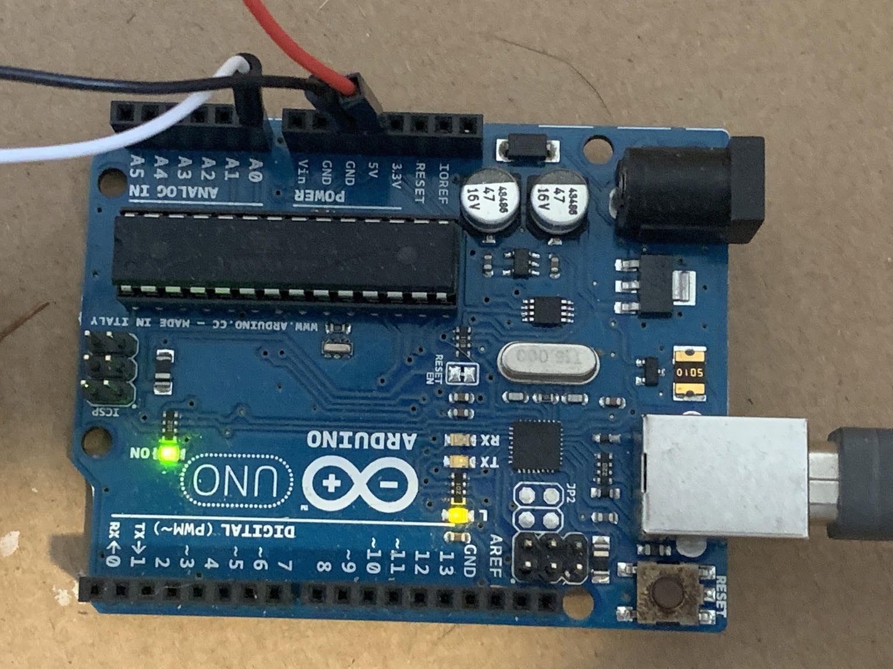

-   Red into 5V
-   Black to GND
-   White to A0; USB to USB of Raspberry Pi monitor

## Rasberry Pi connections:
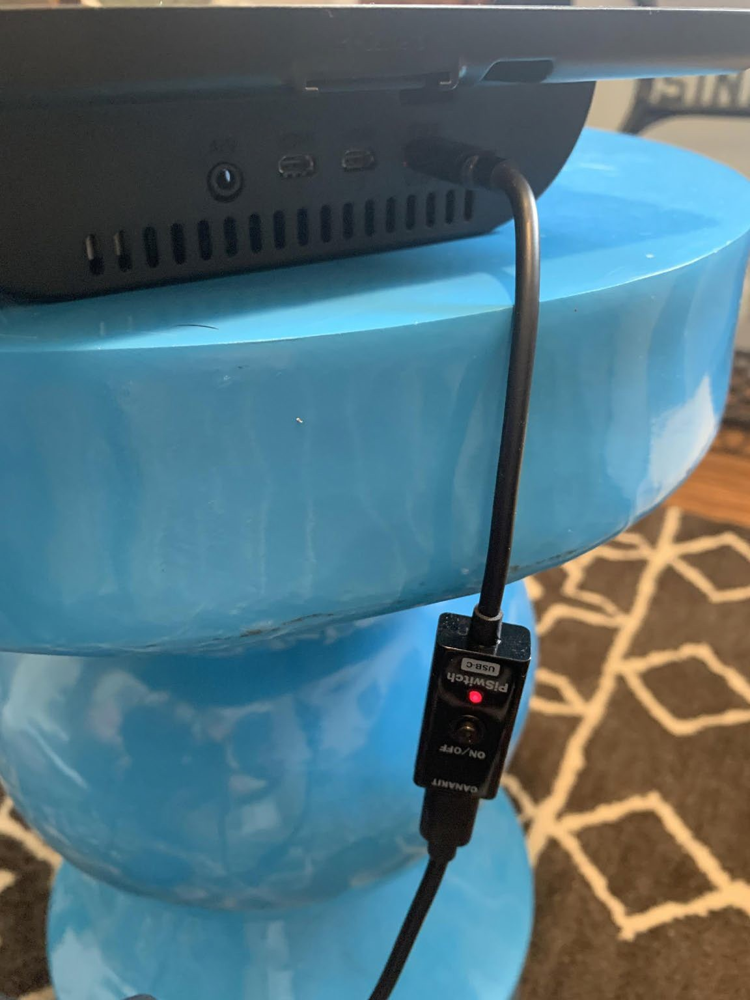

-   Power supply

## Raspberry Pi connections, cont’d.
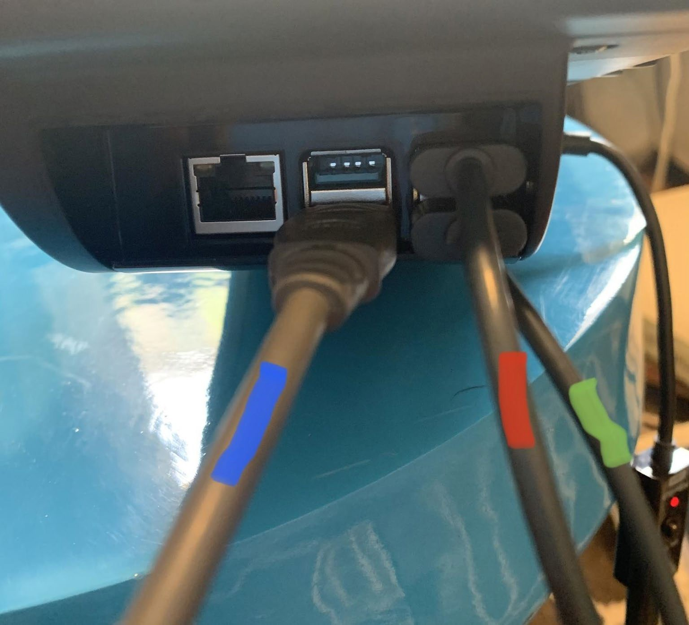

-   Blue is cord to Arduino 
-   Red is cord to keyboard
-   Green is cord to mouse

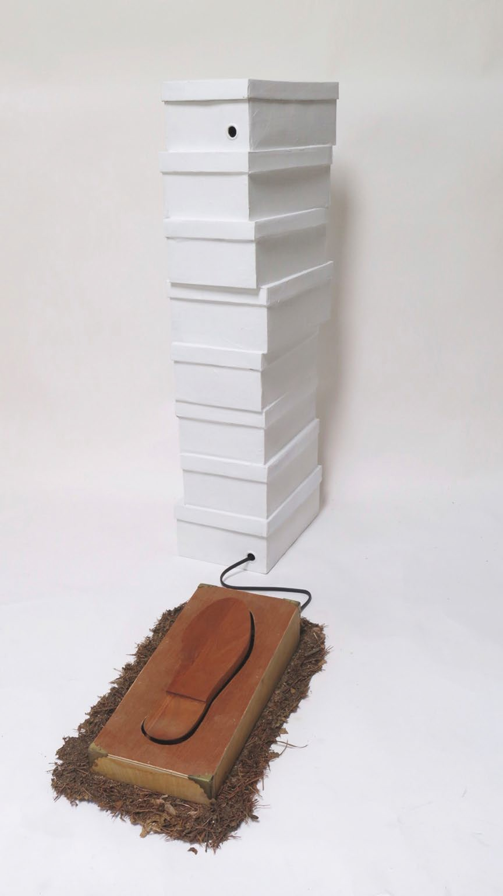

-   The pedal sits centered upon the dirt/pine needle mat
-   The bottom box houses all of the electronics; gently nest them inside
-   The stack of boxes fit over the bottom box
-   The top box houses the wireless speaker.
-   position the pedal in front of and slightly to the right of the stack of boxes

## Power Up / Turn Up the Bluetooth Speaker

-   Open the top box -- connect the cable to the speaker
-   Turn the speaker on (line shaped button)
-   Turn the volume up (+ button)… it will start beeping when it is all the way up

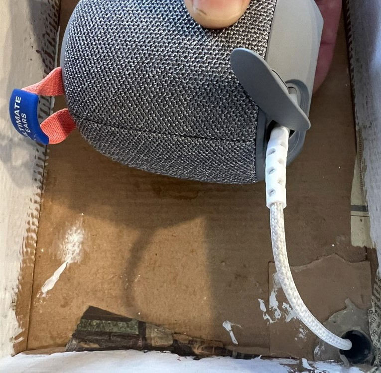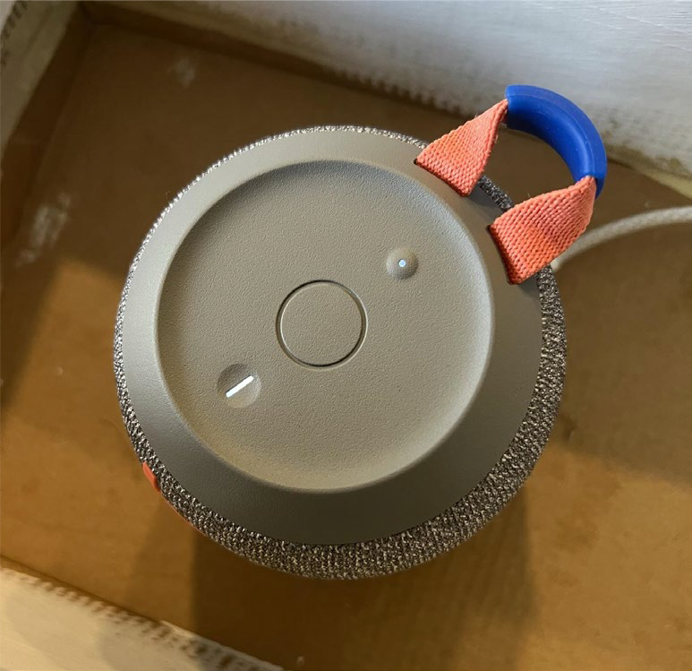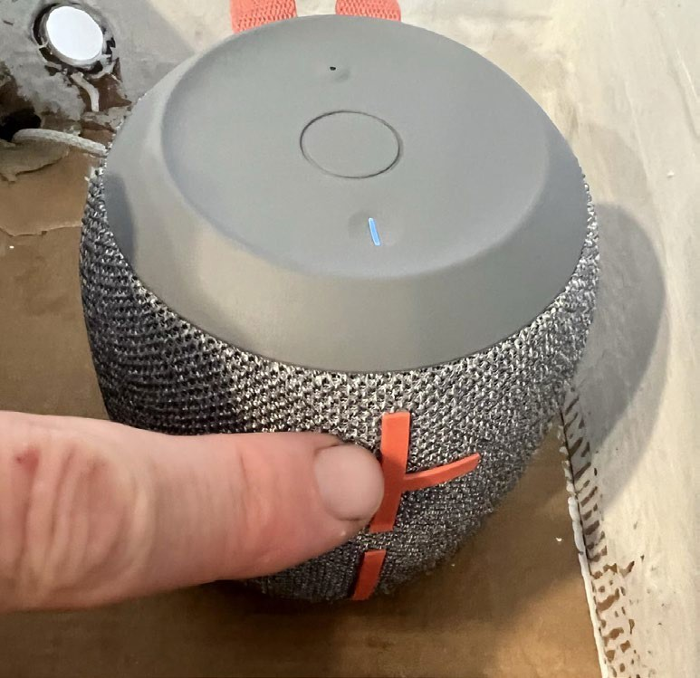

## Turn on the Rasberry Pi

-   Press the Power Button (on the cord)
-   The Pi will boot up
-   This is what the home screen looks like

## Configure Pi Audio Output

-   Right Click the Speaker icon
-   Select Audio Outputs
-   Select ‘Wonderboom 2’ if not already selected
1.  RIGHT Click speaker icon
2.  Select Wonderboom2
3.  If 'Wonderboom2' is not an option you'll need to go to Bluetooth Settings to connect to the speaker (see next step)

## Connect the Bluetooth Speaker
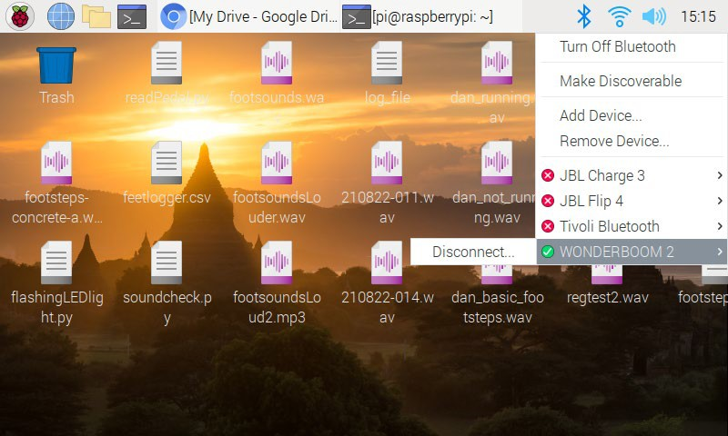

-   Click the BLE Icon using the mouse
-   Ensure ‘Wonderboom 2’ speaker is connected
1.  Click BLE icon
2.  Select Wonderboom2 if not already selected
## Starting the Python IDE

-   Select the Raspberry Pi button in the upper left
-   Select ‘Programming’
-   Select ‘Thony Python IDE’

## Playing the ‘newfootsounds.py’ Program

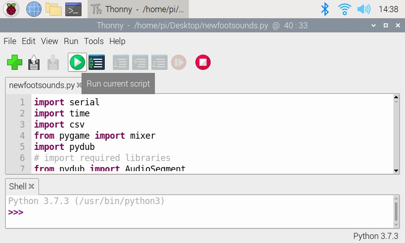

-   The ‘newfootsounds.py’ file should already be loaded
-   Press the green ‘Play’ button to start the script

## Playing the ‘newfootsounds.py’ Program

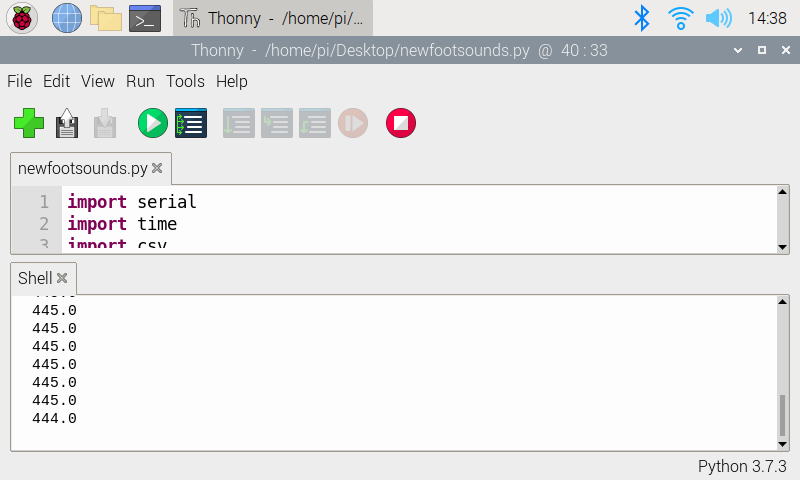

-   The ‘newfootsounds.py’ file should already be loaded
-   Press the green ‘Play’ button to start the script
-   Once started readings from the pedal will come in

## Testing the ‘newfootsounds.py’ Program

-   The ‘newfootsounds.py’ file should already be loaded
-   Press the green ‘Play’ button to start the script
-   Once started readings from the pedal will come in
-   Test the connection by pressing the foot pedal
-   Check for sound from speaker
-   If too high turn down speaker
-   if too low turn up speaker

## Dealing with ‘newfootsounds.py’ errors

-   if script stops and there is a red error message in terminal window on the bottom of the Thonny interface, press red stop button then press play button again.
-   if that doesn’t work, press stop, then close the Thonny program by clicking x in upper right corner of the application. Then restart Thonny and press play on program as described in previous slide.

## ‘newfootsounds.py’ code (read only / for reference only) .

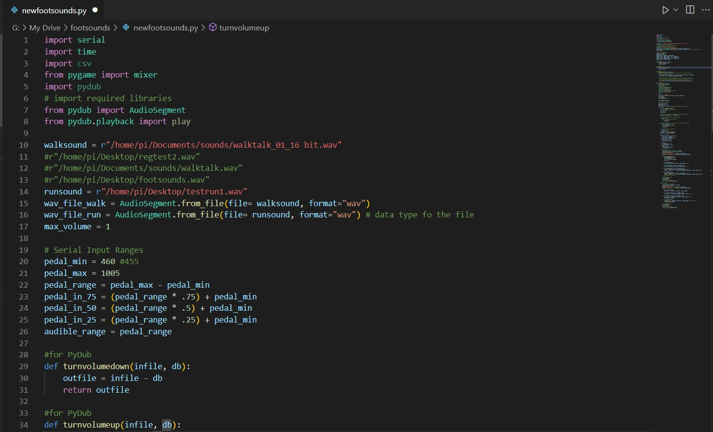

[https://github.com/captain-walrus/footsounds](https://github.com/captain-walrus/footsounds/blob/main/newfootsounds.py)

## Backup .wav file for the footsounds 

## Power supply options:

-   Both the Pi and speaker can be powered via the Anker battery pack, however it will need recharging every couple of days depending on usage.
-   Alternately, the Pi and speaker can be directly plugged in via the supplied cords, however cords and outlet should be hidden beneath the shoebox tower.
