# footsounds
code for the footsounds sculpture

Homage to Long Walk

Installation info Danielle Giudici Wallis

# Parts:

-   Foot pedal
-   Cardboard box tower
-   Bluetooth speaker
-   Arduino
-   Raspberry pi and monitor
-   Keyboard
-   Screen
-   Mouse
-   Power cables
-   Breadboard
-   Jumper wires

Pedal: Top and bottom of wooden foot pedal are pressure fit only. To assemble, align cover and cord (there is a small hole at the top for the cord); press firmly. To disassemble, lift wooden foot pedal and press firmly on wooden bottom.

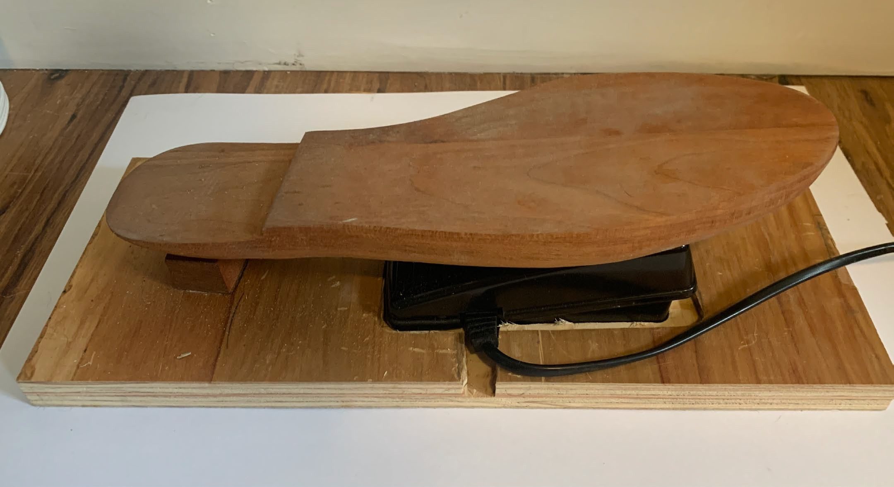

# Arduino and bread board connections

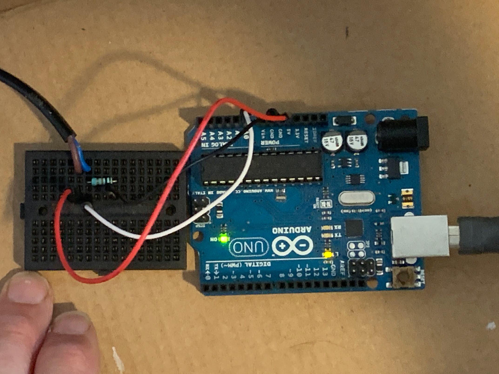

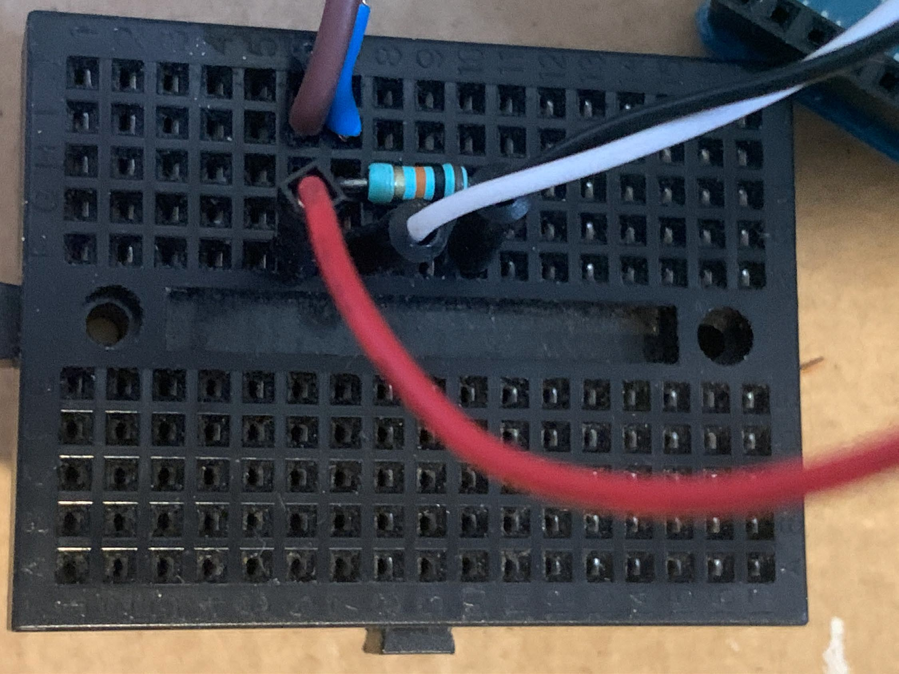Bread Board diagram

Wires from Pedal to Bread Board: Brown to i6; Blue to i7; Red to f6; White to f7; Black to f10; resistor h7-h10

Arduino Diagram

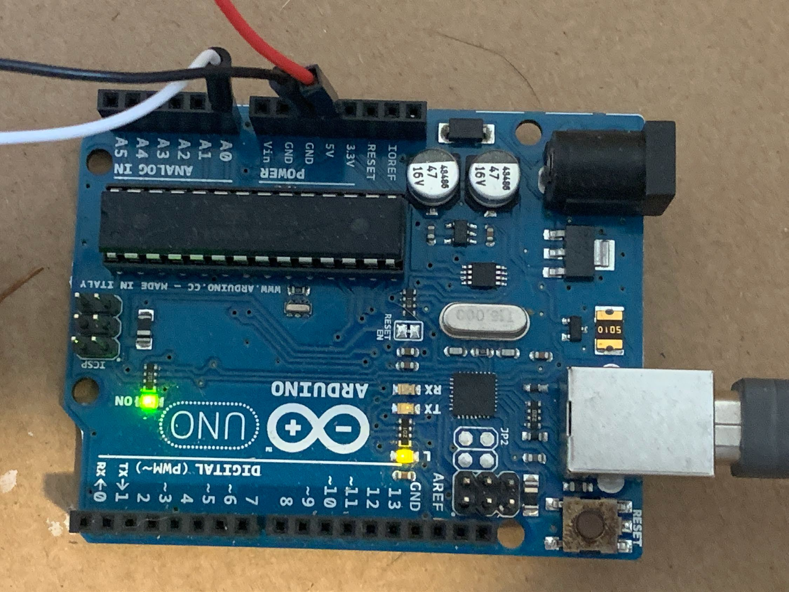

Red into 5V; Black to GND; White to A0; USB to USB of Raspberry Pi monitor

# 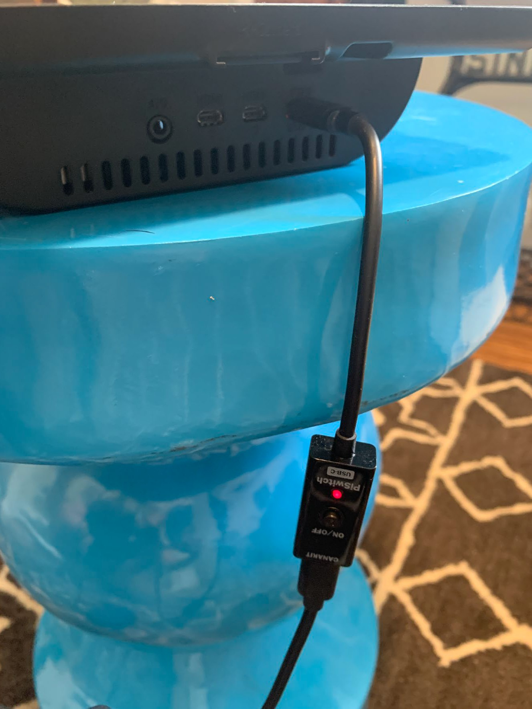Rasberry Pi connections:

Top: Power supply

# 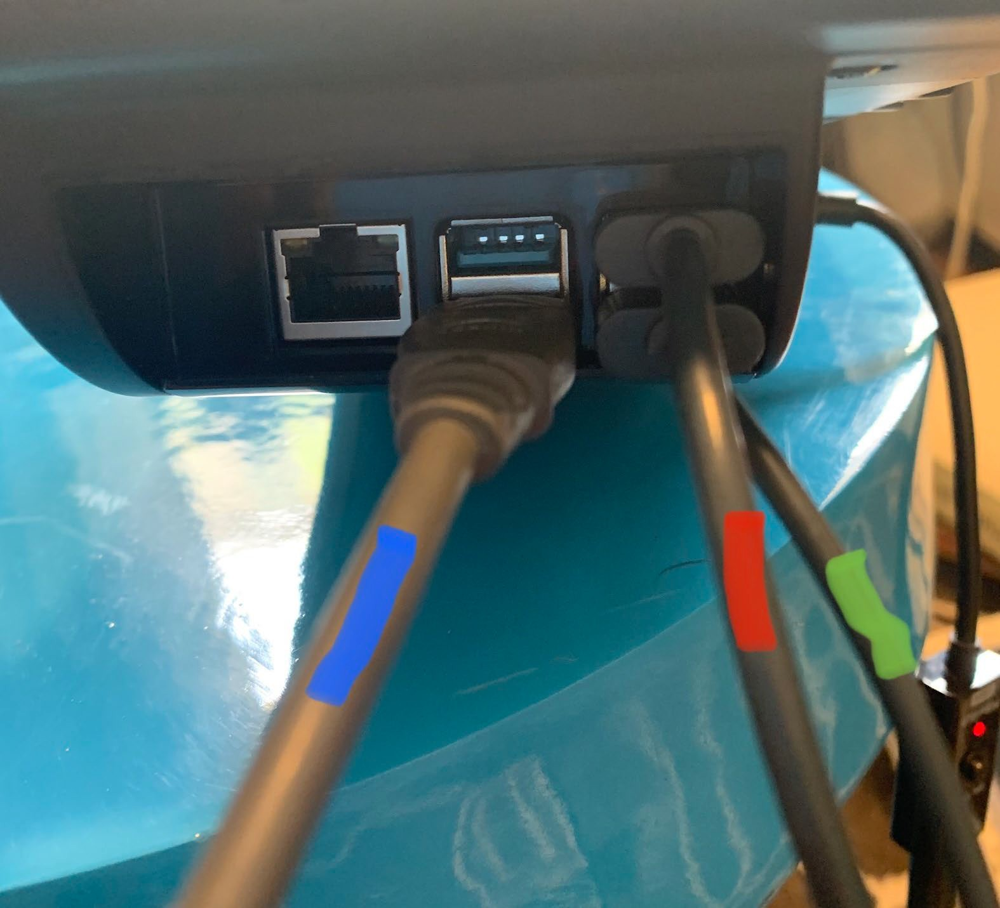Raspberry Pi connections, cont’d.

Right Side:

Blue is cord to Arduino Red is cord to keyboard Green is cord to mouse

-   The stack of boxes fits over the bottom box which houses all of the electronics
-   The top box houses the wireless speaker

# Power Up / Turn Up the Bluetooth Speaker

-   Open the top box -- connect the cable to the speaker
-   Turn the speaker on
-   Turn the volume up … it will start beeping when it is all the way up

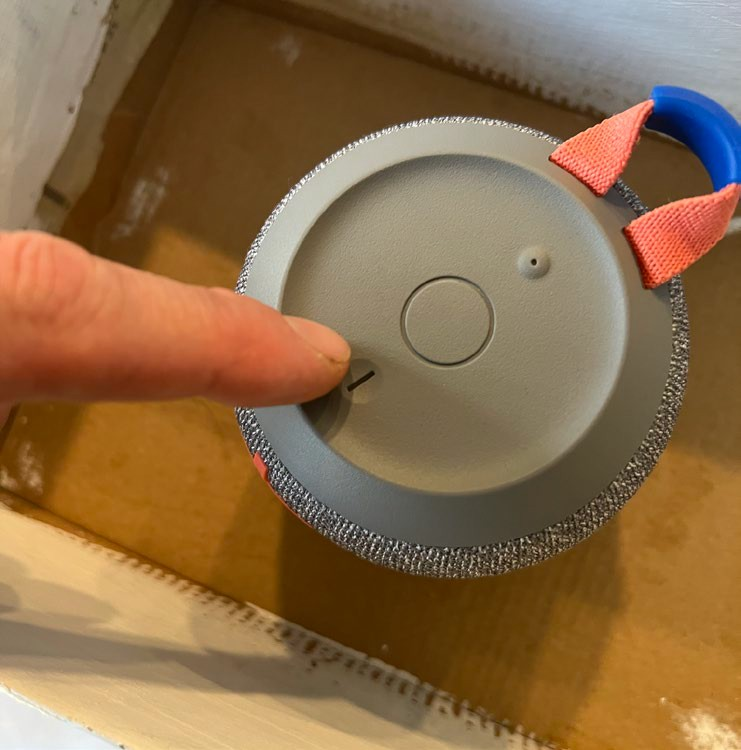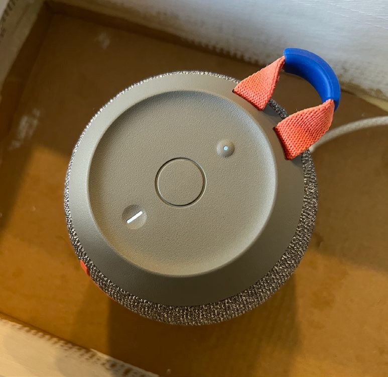

# Turn on the Rasberry Pi

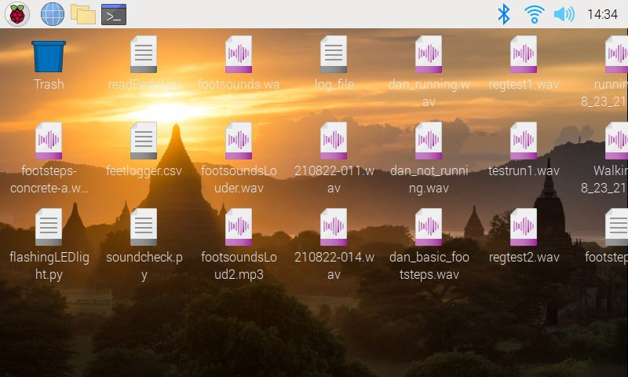
-   Press the Power Button
-   The Pi will boot up
-   This is what the home screen looks like

# Connect the Bluetooth Speaker
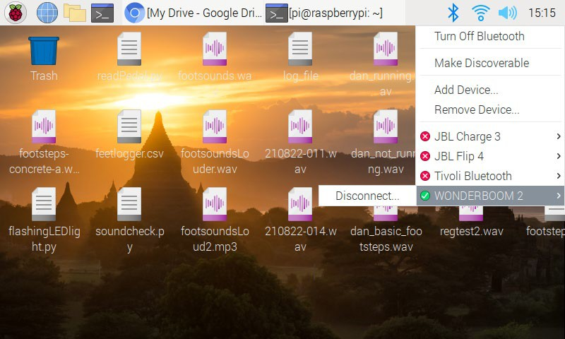

-   Click the BLE Icon
-   Ensure ‘Wonderboom 2’ speaker is connected
1.  Click BLE icon
1.  Select Wonderboom2 if not already selected

# 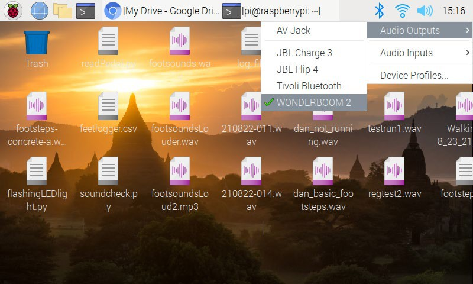Configure Pi Audio Output

-   Right Click the Speaker icon
-   Select Audio Outputs
-   Select ‘Wonderboom 2’ if not already selected
1.  RIGHT Click speaker icon
1.  Select Wonderboom2

# Starting the Python IDE

-   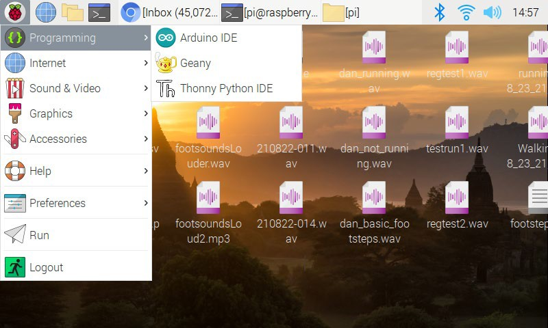Select the Pi button in the upper left
    -   Select ‘Programming’
        -   Select ‘Thony Python IDE’

# Playing the ‘newfootsounds.py’ Program

-   The ‘newfootsounds.py’ file should already be loaded
    -   Press the green ‘Play’ button to start the script

# Playing the ‘newfootsounds.py’ Program

-   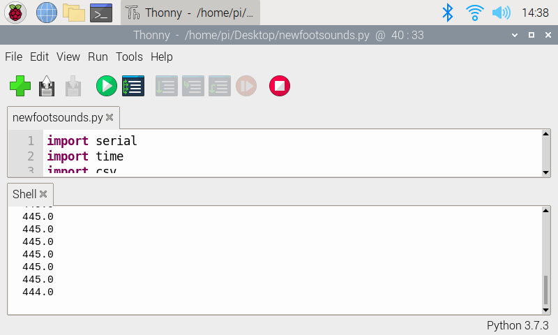The ‘newfootsounds.py’ file should already be loaded
    -   Press the green ‘Play’ button to start the script
        -   Once started readings from the pedal will come in

# Testing the ‘newfootsounds.py’ Program

-   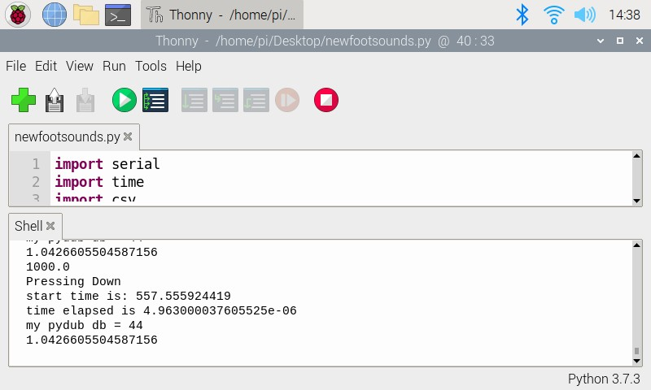The ‘newfootsounds.py’ file should already be loaded
    -   Press the green ‘Play’ button to start the script
        -   Once started readings from the pedal will come in
        -   Test the connection by pressing the foot pedal
        -   Check for sound from speaker
        -   If too high turn down speaker
        -   if too low turn up speaker

# ‘newfootsounds.py’ code

-   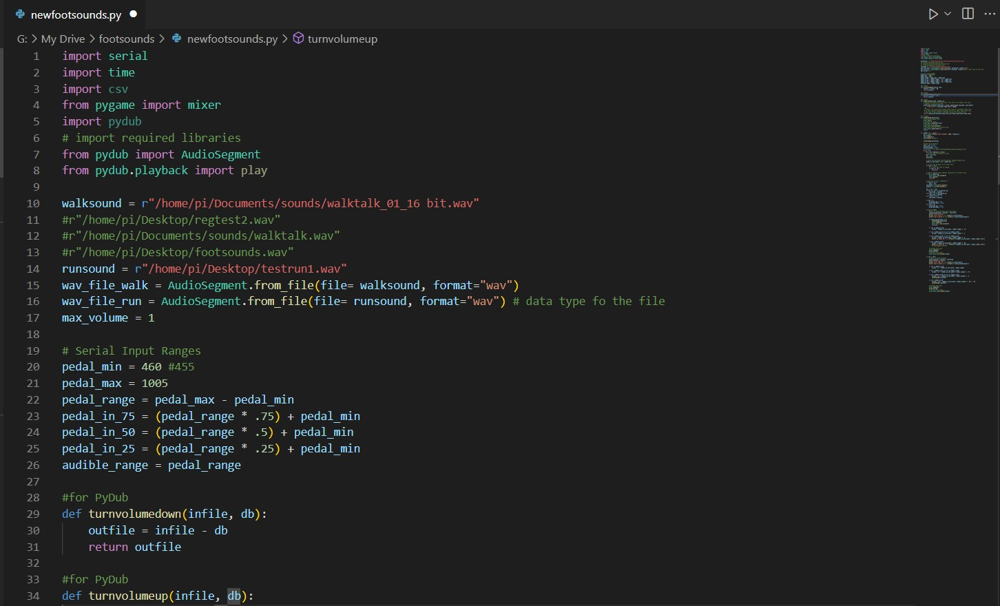The ‘newfootsounds.py’ file should already be loaded
    -   Press the green ‘Play’ button to start the script
        -   Once started readings from the pedal will come in
        -   Test the connection by pressing the foot pedal
        -   Check for sound from speaker
        -   If too high turn down speaker
        -   if too low turn up speaker
